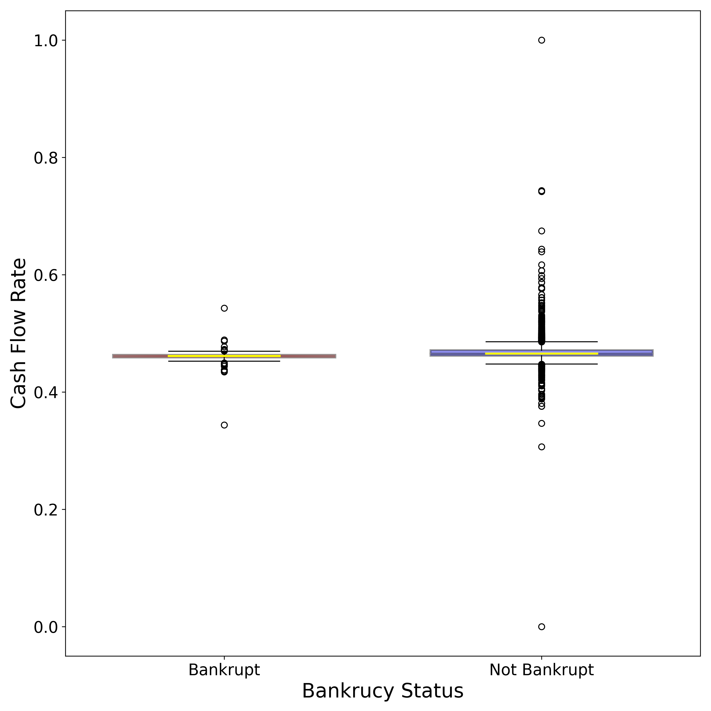
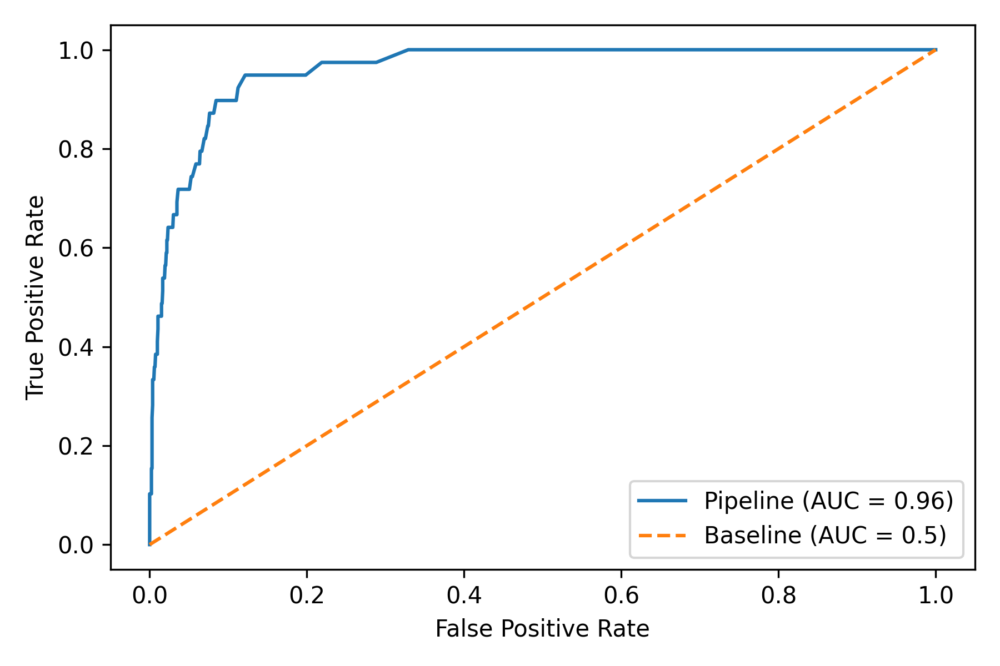

# Company-Bankruptcy-Prediction
This model classifies a company as one that is bankrupt  or not based on a number of features. The data was downloaded from https://www.kaggle.com/fedesoriano/company-bankruptcy-prediction

# Context and background of the data
The data was collected from the Taiwan Economic Journal for the years 1999 to 2009. Company bankruptcy was defined based on the business regulations of the Taiwan Stock Exchange.

# Correlation heatmap
This is a correlation heapmap based on the features in the dataset 

# BoxPlot
The blx plot below shows the distribution of the cash flow rate of the various institutions surveyed 

# ROC curve
After modeling using random forests from SciKit learn, The area under curve plot shows the accuracy of the model. Its able to predict bankrupcy status with a 96% accuracy 

